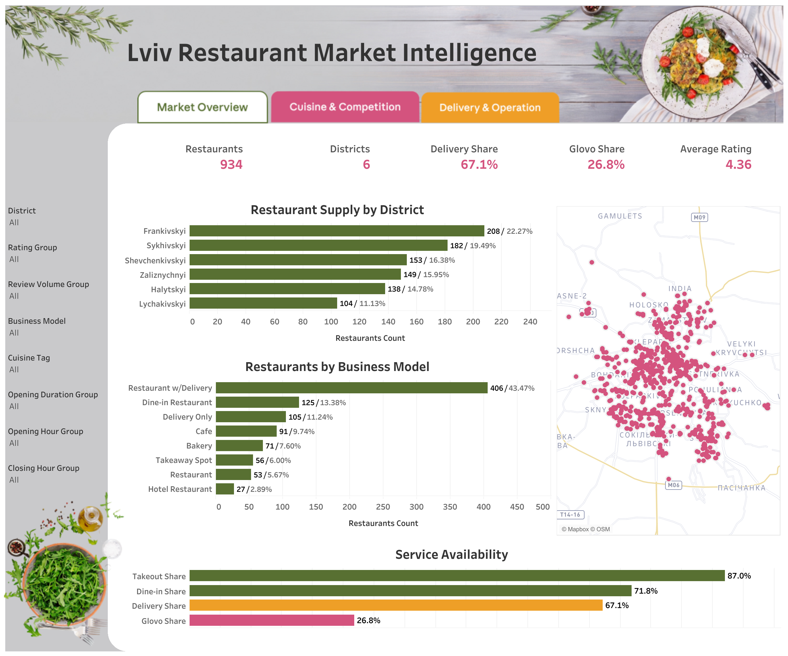
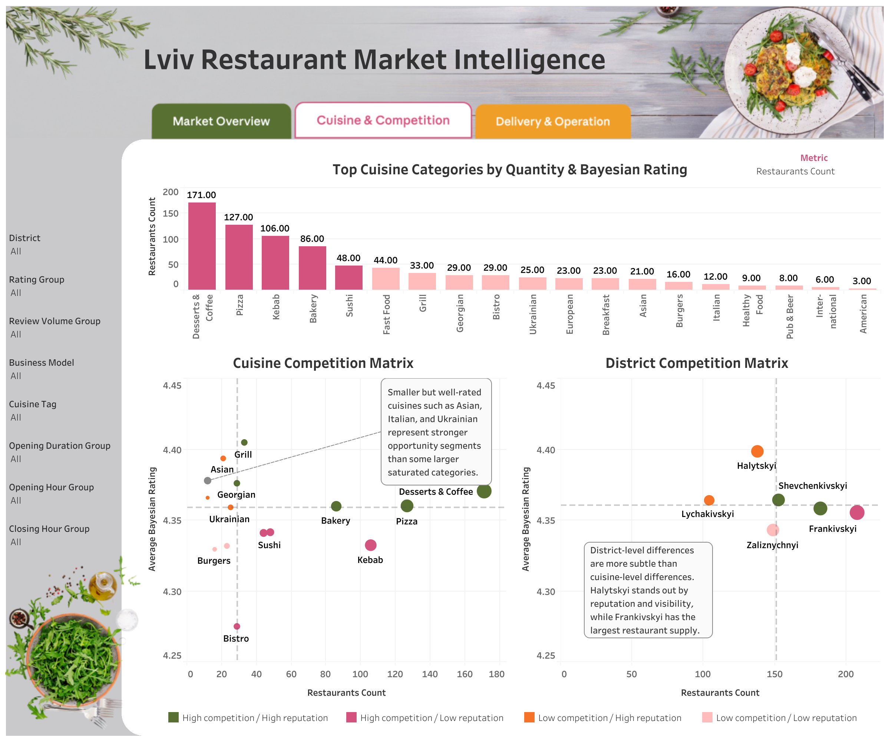
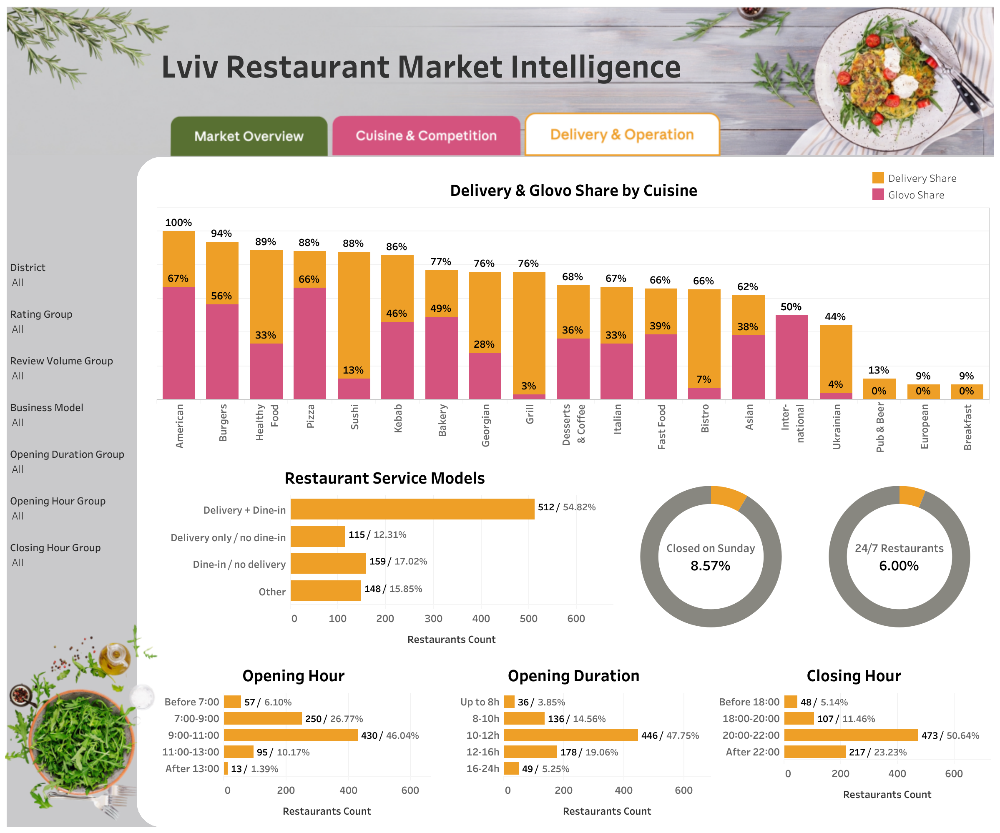
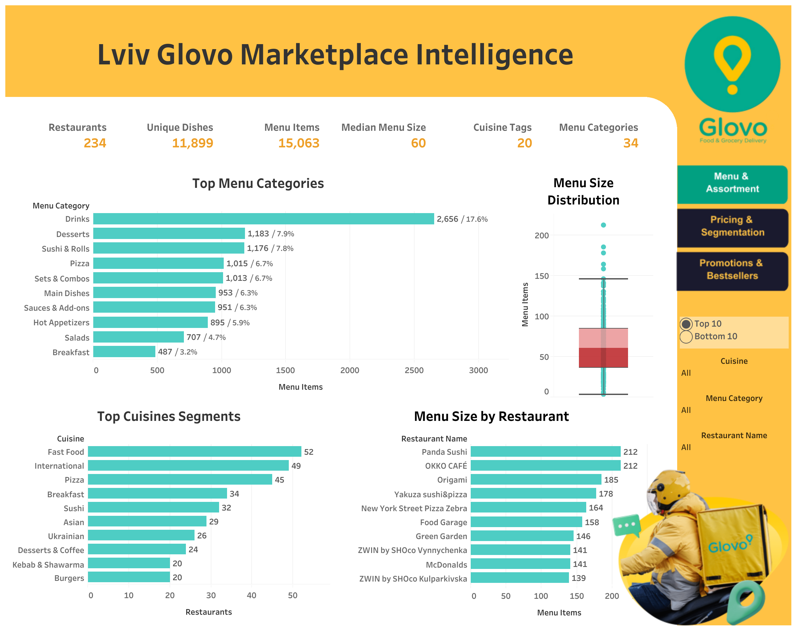
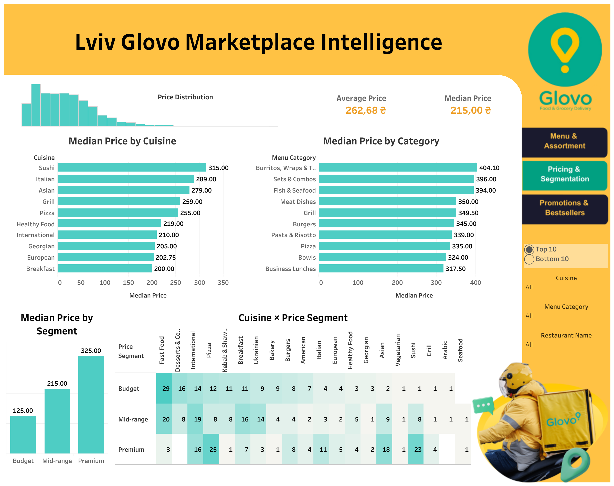
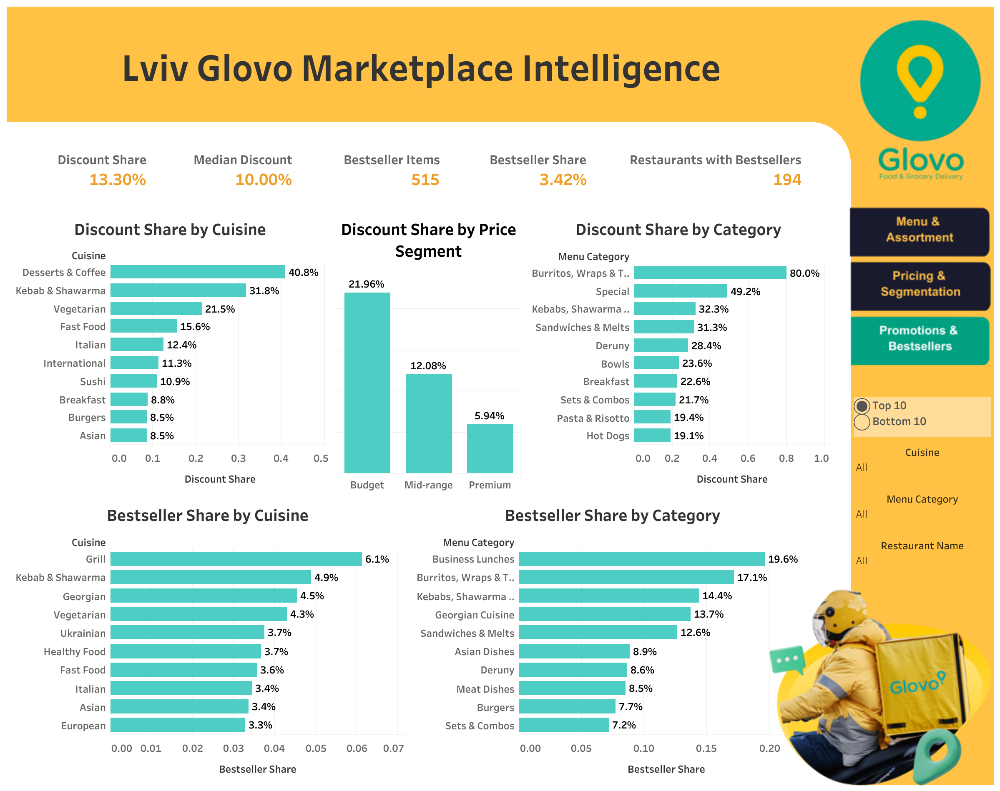
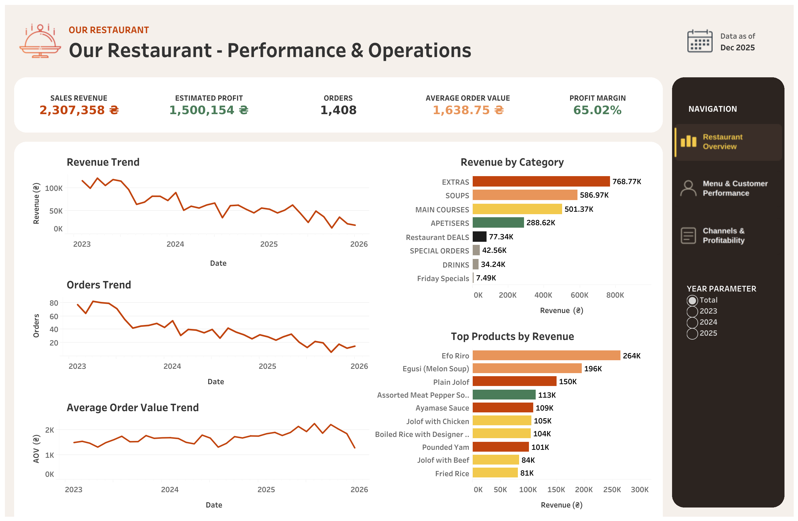
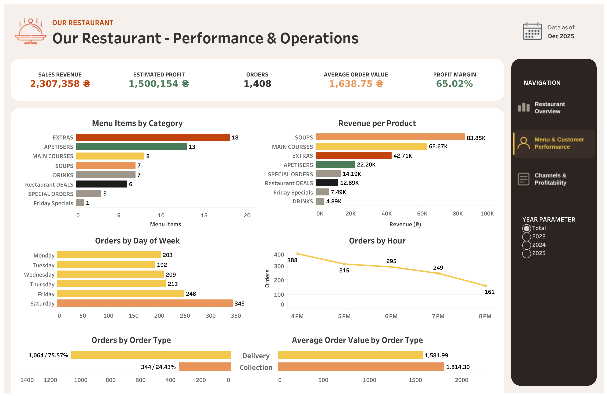
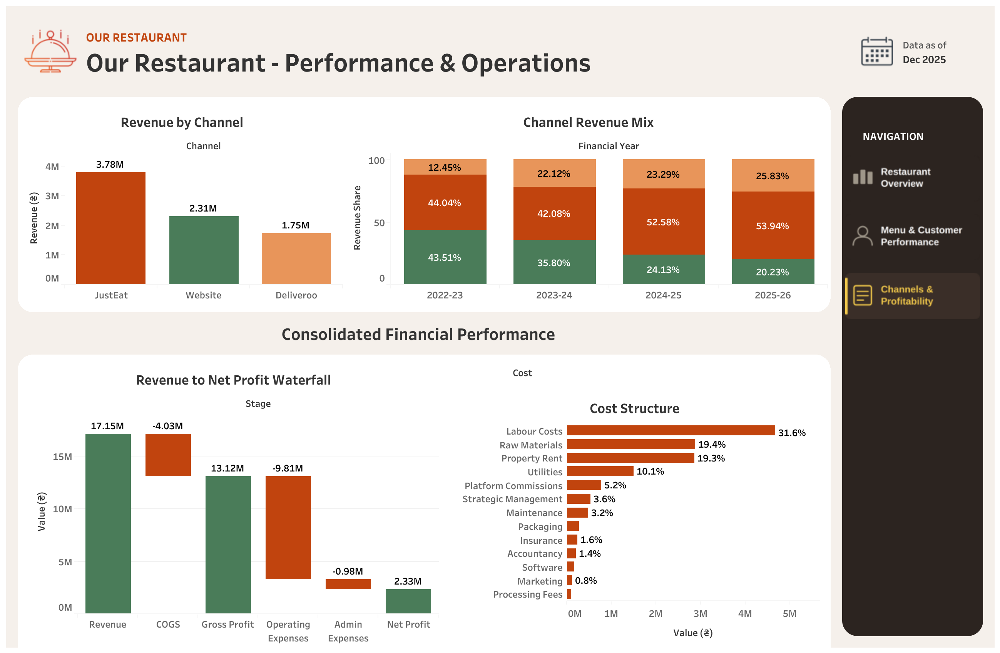
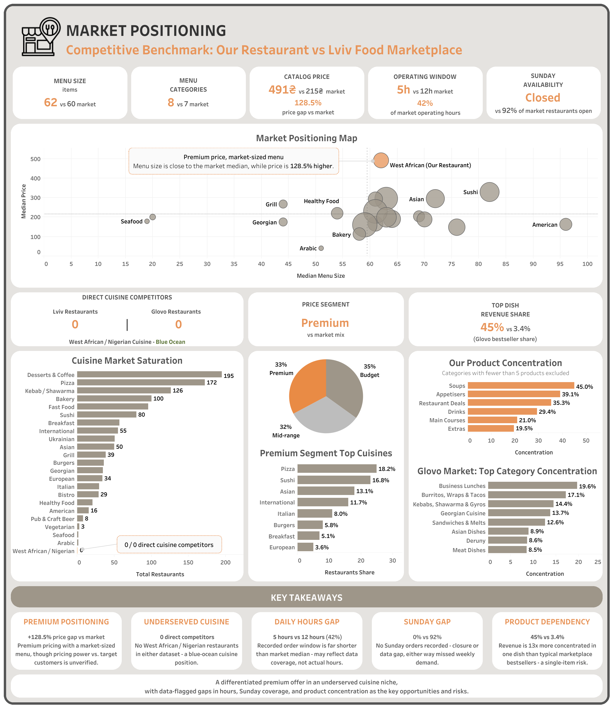

## Dashboards

---
### 01 - Lviv Restaurant Market Intelligence
[View Tableau Dashboard](https://public.tableau.com/views/LvivRestaurantMarket/Market?:language=en-US&:sid=&:redirect=auth&:display_count=n&:origin=viz_share_link)

Screenshots: [Market Overview](screenshots/01-1-Market-Overview.png) | [Cuisine & Competition](screenshots/01-2-Cuisine&Competition.png) | [Delivery & Operation](screenshots/01-3-Delivery&Operation.png)

  

---

### 02 - Glovo Marketplace Intelligence
[View Tableau Dashboard](https://public.tableau.com/views/LvivGlovoMarketplace/MenuAssortment?:language=en-US&:sid=&:redirect=auth&:display_count=n&:origin=viz_share_link)

Screenshots: [Menu & Assortment](screenshots/02-1-Menu&Assortment.png) | [Pricing & Segmentation](screenshots/02-2-Pricing&Segmentation.png) | [Promotions & Bestsellers](screenshots/02-3-Promotions&Bestsellers.png)

  

---

### 03 - Our Restaurant - Performance & Operations
[View Tableau Dashboard](https://public.tableau.com/views/RestaurantPerfomanceOperations1/RestaurantOverview?:language=en-US&:sid=&:redirect=auth&:display_count=n&:origin=viz_share_link)

Screenshots: [Restaurant Overview](screenshots/03-1-Restaurant-Overview.png) | [Menu & Customers](screenshots/03-2-Menu&Customers.png) | [Channels & Profitability](screenshots/03-3-Channels&Profitability.png)

  

---

### 04 - Competitive Benchmark & Strategic Positioning
[View Tableau Dashboard](https://public.tableau.com/views/MarketPositioningCompetitiveBenchmark/MarketPositioning?:language=en-US&:sid=&:redirect=auth&:display_count=n&:origin=viz_share_link)

Screenshot: [Market Positioning](screenshots/04-Market-Positioning.png)

